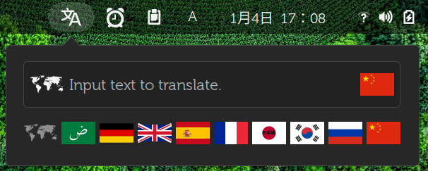

# gnome-shell-clip-translator

---

第二个javascript程序。继续猜。

auto translate selected text to locale language. (X selection "primary" / XA_PRIMARY)



- 自动翻译：如果打开，选择文字，菜单会立刻弹出翻译结果。
- 如果关闭，选择文字后，需要点击菜单，打开后才翻译。
- 文本输入栏，输入文字回车，会翻译。
- 输入栏的主次图标表示翻译的语言设置，点击会弹出图标，以选择语言。世界地图表示自动检测语言。
- 没有显示的语言，需要做一个svg文件，放到img目录，文件名前缀改成locale写法的语言名，比如fra,de,en等。参照[常见语种列表](http://api.fanyi.baidu.com/doc/21)的国家命名。在`extension.js`的64行列表里面增加新的文件名前缀。
- 目前只做了百度翻译接口。
- 百度接口的日活是每小时1千次，否则当日封号。如果翻译量大，可以去[百度api平台](http://api.fanyi.baidu.com/manage/developer)注册一个帐号，得到一个ID和密钥，然后把`extension.js`文件里面的appid(121行)和key(122行)替换成自己的，把`metadata.json`文件的name,uuid等改自己的，`~/.local/share/gnome-shell/extensions/`的目录名也改成自己的uuid，这样就脱离了gnome extension的升级管理，自己用一万年。

```
⭕ tree
.
├── extension.js
├── img
│   ├── ara.svg
│   ├── de.svg
│   ├── en.svg
│   ├── fra.svg
│   ├── global-symbolic.svg
│   ├── jp.svg
│   ├── kor.svg
│   ├── ru.svg
│   ├── spa.svg
│   ├── translator-symbolic.svg
│   ├── trans-symbolic.svg
│   └── zh.svg
├── locale
│   └── zh_CN
│       └── LC_MESSAGES
│           └── clip-translator.mo
├── md5.js
├── metadata.json
└── stylesheet.css
```
---
Special thanks `JustPerfection`